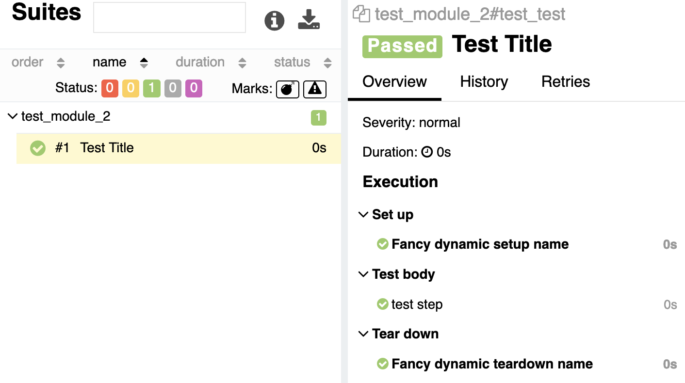

# pytest-glamor-allure

pytest plugin extending allure behaviour

1. [Why has it been created?](#why_created)
2. [What is it?](#what_it_is)
3. [Why is it named "glamor"?](#name_glamor)
4. [How to install?](#instalation)
5. [What does it can?](#what_does_it_can)
   * [Fancy names for setups and teardowns](#fancy_names)
   * [Hide setup and teardown](#hide_fixture)
   * [Display 'scope' and 'autouse' parameters in fixture title](#display_scope)
   * [No more '::0' in teardown title](#no_more_ending)
   * [Add allure.step titles into logging](#logging_step)
   * [What else?](#what_else)
6. [Pleasant bonus 🎁](#pleasant_bonus)
7. [How can I help?](#how_help)

## <a name="why_created">Why has it been created?</a>

Just because [allure-python](https://github.com/allure-framework/allure-python) plugin accepts PRs very slowly. Sad but true.

I want to inject more functionality into it. That's why I've decided to create this plugin.

## <a name="what_it_is">What is it?</a>

As been said it is pytest plugin (tnx captain 😄). Consider this plugin just as some extension for [allure-pytest](https://github.com/allure-framework/allure-python/tree/master/allure-pytest).

Hopefully, they'll see this code and add some of this functionality later.

## <a name="name_glamor">Why is it named "glamor"?</a>

Because "glamor" is a synonym for "allure". Glamor does the same thing as allure-pytest does but a little more.

The main idea is to just replace imports in you project: instead of `import allure` you type `import glamor as allure` and everything works as before.

## <a name="instalation">How to install?</a>

```shell
pip install pytest-glamor-allure
````

That's it.

## <a name="what_does_it_can">What does it can?</a>

It's the most interesting part of the ReadMe.

### <a name="fancy_names">Fancy names for setups and teardowns</a>

[allure-python](https://github.com/allure-framework/allure-python) provides possibility to set title for fixture with `@allure.title` decorator.

But there is no chance to set different titles for setup and teardown.
Glamor does can this!

```python
import pytest
import glamor as allure

@pytest.fixture
@allure.title.setup('Fancy setup name')
@allure.title.teardown('Fancy teardown name')
def fixture():
    yield

@allure.title('Test Title')
def test_test(fixture):
    with allure.step('test step'):
        pass
```


And moreover. You can dynamically change setup and teardown titles for fixtures.

***Only one restriction:*** dynamic hook must be used inside the fixture's body.

```python
import pytest
import glamor as allure


@pytest.fixture
def fixture():
    yield
    allure.dynamic.title.setup('Fancy dynamic setup name')
    allure.dynamic.title.teardown('Fancy dynamic teardown name')


@allure.title('Test Title')
def test_test(fixture):
    with allure.step('test step'):
        pass
```



### <a name="hide_fixture">Hide setup and teardown</a>

Have you ever wanted to conceal setup and/or teardown from 'allure' report?

Well, now you can.

```python
import pytest
import glamor as allure


@pytest.fixture
@allure.title.setup(hidden=True)
@allure.title.teardown('Teardown ONE')
def fixture():
    yield


@pytest.fixture
@allure.title.setup('Setup TWO')
def fixture2():
    yield

    if True:
        allure.dynamic.title.teardown(hidden=True)


@allure.title('Test Title')
def test_test(fixture, fixture2):
    with allure.step('test step'):
        pass
```


But! If any exception (including `Skipped`) is raised, then hidden setups and teardowns are shown forcefully.

```python
import pytest
import glamor as allure


@pytest.fixture
@allure.title.setup('Setup is displayed in case of failure', hidden=True)
@allure.title.teardown('Teardown ONE')
def fixture():
    with allure.step('fail step'):
        assert False, 'some exception in setup'
    yield


@pytest.fixture
@allure.title.setup('Setup TWO')
def fixture2():
    yield

    if True:
        allure.dynamic.title.teardown(hidden=True)
    pytest.skip('we decided to skip')


@allure.title('Test Title')
def test_test(fixture2, fixture):
    with allure.step('test step'):
        pass
```


### <a name="display_scope">Display 'scope' and 'autouse' fixture parameters in fixture title</a>

Sometimes it is useful to know which scope this fixture is, and was it called manually or autoused.

Just call the function once per runtime `include_scope_in_title` before pytest starts execution of any hook (during modules initialization).

```python
import pytest
import glamor as allure

allure.include_scope_in_title('before', autouse=True)


@pytest.fixture(scope='session', autouse=True)
@allure.title.setup('Fancy setup name')
def fixture():
    yield


@pytest.fixture
@allure.title.setup('Setup TWO')
def fixture2():
    yield


@allure.title('Test Title')
def test_test(fixture2):
    with allure.step('test step'):
        pass
```


The big letter is the first letter of the scope name (one of 'function', 'class', 'module', 'package', 'session'). The lower letter 'a' says that fixture was autoused.

If you want to put this information to the end of the title, then just call the function as `allure.include_scope_in_title('after', autouse=True)` and you get:


### <a name="no_more_ending">No more '::0' in teardown title</a>

Have you noticed '::0' in raw teardown titles? No? That's because glamor strips such ending if fixture has not more than one finalizer.

### <a name="logging_step">Add allure.step titles into logging</a>

Have you ever tried to understand when the particular allure step started looking at tests' logs? Of course, you have!

With "glamor" you can register you own logger, which is considered to print steps' titles into output.

```python
import logging
import sys
import glamor as allure


# Create logger
logger = logging.getLogger('MyLogger')
logger.setLevel(logging.INFO)

fmt = logging.Formatter('[%(levelname)s] %(message)s')

handler = logging.StreamHandler(stream=sys.stdout)
handler.setLevel(logging.INFO)
handler.setFormatter(fmt)

logger.addHandler(handler)

# Register logger in allure
allure.logging_allure_steps(logger)


# Execute tests' code
logger.info("start message")

with allure.step("step message"):
    pass

logger.error("end message")
```

```shell
[INFO] start message
[STEP] step message
[ERROR] end message
```

`logging_allure_steps` should be called only once - during modules initialization. But who am I to restrict you?

If you need you can turn off this behaviour by calling the function with `None` instead of `logging.Logger` instance.

### <a name="what_else">What else?</a>

```python
import glamor as allure

allure.listener  # access to AllureListener plugin instance
allure.reporter  # alias for allure.listener.allure_logger
allure.pytest_config  # access to pytest.Config instance. alias for allure.listener.config
```

Also via 'glamor' module you get direct access to many objects from:

* allure_commons
* allure_commons._allure
* allure_commons.model2
* allure_commons.types
* allure_commons.utils
* allure_pytest.utils

## <a name="pleasant_bonus">Pleasant bonus 🎁</a>

Type `import pitest as pytest` instead of `import pytest` and get direct access to a bunch of objects from `pytest` and `_pytest` modules.

## <a name="how_help">How can I help?</a>

Your contribution is highly appreciated. Please read [CONTRIBUTION.md](CONTRIBUTION.md) before you start.

